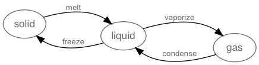

# Javascript State Machine

[](https://www.npmjs.org/package/javascript-state-machine)
[](https://travis-ci.org/jakesgordon/javascript-state-machine)

A library for finite state machines.



<br>

### NOTE for existing users

> **VERSION 3.0** Is a significant rewrite from earlier versions.
  Existing 2.x users should be sure to read the [Upgrade Guide](docs/upgrading-from-v2.md).

<br>

# Installation

In a browser:

```html
  <script src='state-machine.js'></script>
```

> after downloading the [source](dist/state-machine.js) or the [minified version](dist/state-machine.min.js)

Using npm:

```shell
  npm install --save-dev javascript-state-machine
```

In Node.js:

```javascript
  var StateMachine = require('javascript-state-machine');
```

# Usage

A state machine can be constructed using:

```javascript
  var fsm = new StateMachine({
    init: 'solid',
    transitions: [
      { name: 'melt',     from: 'solid',  to: 'liquid' },
      { name: 'freeze',   from: 'liquid', to: 'solid'  },
      { name: 'vaporize', from: 'liquid', to: 'gas'    },
      { name: 'condense', from: 'gas',    to: 'liquid' }
    ],
    methods: {
      onMelt:     function() { console.log('I melted')    },
      onFreeze:   function() { console.log('I froze')     },
      onVaporize: function() { console.log('I vaporized') },
      onCondense: function() { console.log('I condensed') }
    }
  });
```

... which creates an object with a current state property:

  * `fsm.state`

... methods to transition to a different state:

  * `fsm.melt()`
  * `fsm.freeze()`
  * `fsm.vaporize()`
  * `fsm.condense()`

... observer methods called automatically during the lifecycle of a transition:

  * `onMelt()`
  * `onFreeze()`
  * `onVaporize()`
  * `onCondense()`

... along with the following helper methods:

  * `fsm.is(s)`            - return true if state `s` is the current state
  * `fsm.can(t)`           - return true if transition `t` can occur from the current state
  * `fsm.cannot(t)`        - return true if transition `t` cannot occur from the current state
  * `fsm.transitions()`    - return list of transitions that are allowed from the current state
  * `fsm.allTransitions()` - return list of all possible transitions
  * `fsm.allStates()`      - return list of all possible states

# Terminology

A state machine consists of a set of [**States**](docs/states-and-transitions.md)

  * solid
  * liquid
  * gas

A state machine changes state by using [**Transitions**](docs/states-and-transitions.md)

  * melt
  * freeze
  * vaporize
  * condense

A state machine can perform actions during a transition by observing [**Lifecycle Events**](docs/lifecycle-events.md)

  * onBeforeMelt
  * onAfterMelt
  * onLeaveSolid
  * onEnterLiquid
  * ...

A state machine can also have arbitrary [**Data and Methods**](docs/data-and-methods.md).

Multiple instances of a state machine can be created using a [**State Machine Factory**](docs/state-machine-factory.md).

# Documentation

Read more about

  * [States and Transitions](docs/states-and-transitions.md)
  * [Data and Methods](docs/data-and-methods.md)
  * [Lifecycle Events](docs/lifecycle-events.md)
  * [Asynchronous Transitions](docs/async-transitions.md)
  * [Initialization](docs/initialization.md)
  * [Error Handling](docs/error-handling.md)
  * [State History](docs/state-history.md)
  * [Visualization](docs/visualization.md)
  * [State Machine Factory](docs/state-machine-factory.md)
  * [Upgrading from 2.x](docs/upgrading-from-v2.md)
 
# Contributing

You can [Contribute](docs/contributing.md) to this project with issues or pull requests.

# Release Notes

See [RELEASE NOTES](RELEASE_NOTES.md) file.

# License

See [MIT LICENSE](https://github.com/jakesgordon/javascript-state-machine/blob/master/LICENSE) file.

# Contact

If you have any ideas, feedback, requests or bug reports, you can reach me at
[jake@codeincomplete.com](mailto:jake@codeincomplete.com), or via
my website: [Code inComplete](http://codeincomplete.com/)
