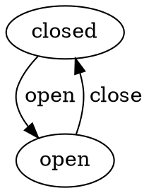
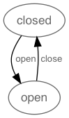
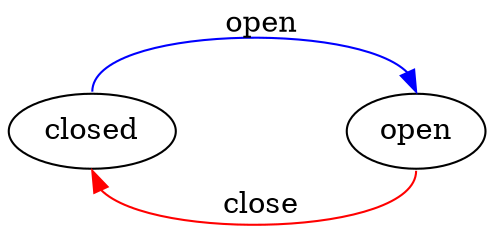
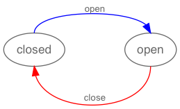
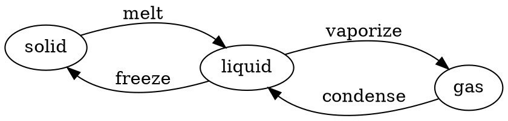
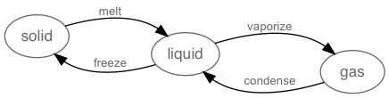
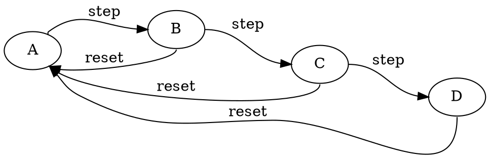
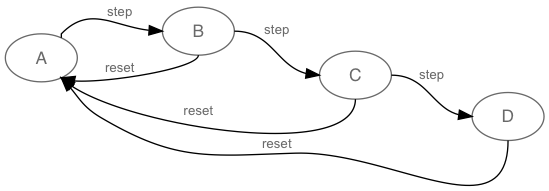
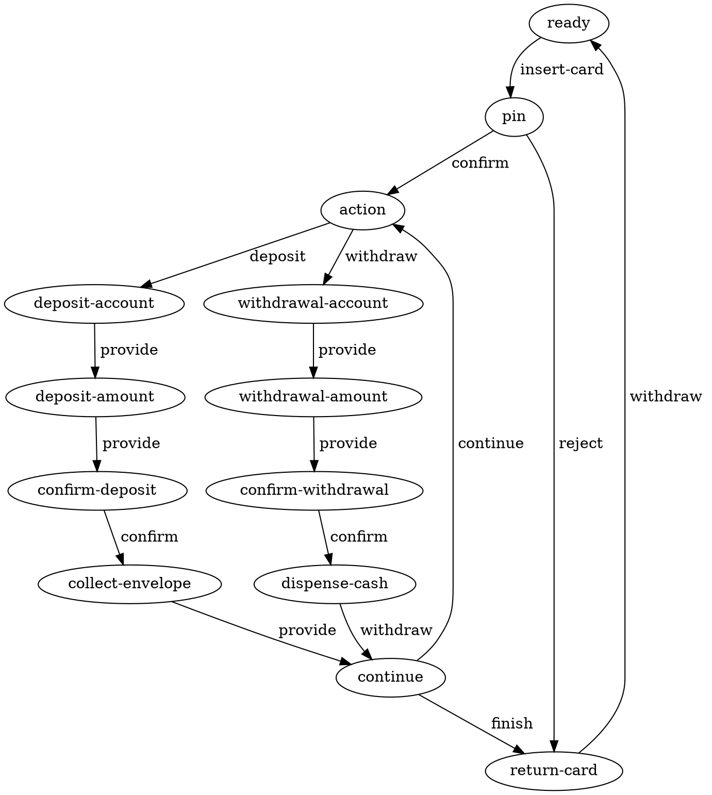
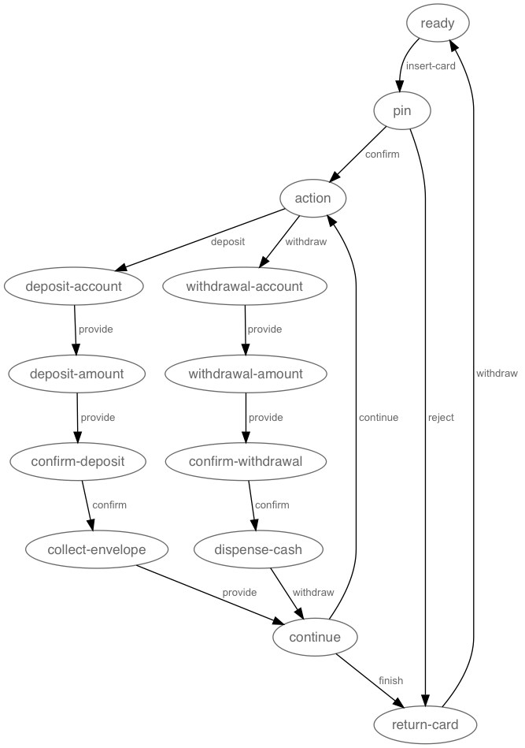

# Visualization

It can be very helpful to visualize your state machine as a directed graph. This is possible
with the open source [GraphViz](http://www.graphviz.org/) library if we convert from our
state machine configuration to the `.dot` language expected by GraphViz using the
`visualize` method:

```javascript
  var visualize = require('javascript-state-machine/lib/visualize');

  var fsm = new StateMachine({
    init: 'open',
    transitions: [
      { name: 'close', from: 'open',   to: 'closed' },
      { name: 'open',  from: 'closed', to: 'open'   }
    ]
  });

  visualize(fsm)
```

Generates the following .dot syntax:



Which GraphViz displays as:



## Enhanced Visualization

You can customize the generated `.dot` output - and hence the graphviz visualization - by attaching 
`dot` attributes to your transitions and (optionally) declaring an `orientation`:

```javascript
  var fsm = new StateMachine({
    init: 'closed',
    transitions: [
      { name: 'open',  from: 'closed', to: 'open',   dot: { color: 'blue', headport: 'n', tailport: 'n' } },
      { name: 'close', from: 'open',   to: 'closed', dot: { color: 'red',  headport: 's', tailport: 's' } }
    ]
  });
  visualize(fsm, { name: 'door', orientation: 'horizontal' });
```

Generates the following (enhanced) `.dot` syntax:



Which GraphViz displays as:



## Visualizing State Machine Factories

You can use the same `visualize` method to generate `.dot` output for a state machine factory:

```javascript
  var Matter = StateMachine.factory({
    init: 'solid',
    transitions: [
      { name: 'melt',     from: 'solid',  to: 'liquid', dot: { headport: 'nw' } },
      { name: 'freeze',   from: 'liquid', to: 'solid',  dot: { headport: 'se' } },
      { name: 'vaporize', from: 'liquid', to: 'gas',    dot: { headport: 'nw' } },
      { name: 'condense', from: 'gas',    to: 'liquid', dot: { headport: 'se' } }
    ]
  });

  visualize(Matter, { name: 'matter', orientation: 'horizontal' })
```

Generates the following .dot syntax:



Which GraphViz displays as:



## Other Examples

```javascript
  var Wizard = StateMachine.factory({
    init: 'A',
    transitions: [
      { name: 'step',  from: 'A',               to: 'B', dot: { headport: 'w',  tailport: 'ne' } },
      { name: 'step',  from: 'B',               to: 'C', dot: { headport: 'w',  tailport: 'e' } },
      { name: 'step',  from: 'C',               to: 'D', dot: { headport: 'w',  tailport: 'e' } },
      { name: 'reset', from: [ 'B', 'C', 'D' ], to: 'A', dot: { headport: 'se', tailport: 's' } }
    ]
  });

  visualize(Wizard, { orientation: 'horizontal' })
```

Generates:



Displays:



```javascript
  var ATM = StateMachine.factory({
    init: 'ready',
    transitions: [
      { name: 'insert-card', from: 'ready',              to: 'pin'                },
      { name: 'confirm',     from: 'pin',                to: 'action'             },
      { name: 'reject',      from: 'pin',                to: 'return-card'        },
      { name: 'withdraw',    from: 'return-card',        to: 'ready'              },

      { name: 'deposit',     from: 'action',             to: 'deposit-account'    },
      { name: 'provide',     from: 'deposit-account',    to: 'deposit-amount'     },
      { name: 'provide',     from: 'deposit-amount',     to: 'confirm-deposit'    },
      { name: 'confirm',     from: 'confirm-deposit',    to: 'collect-envelope'   },
      { name: 'provide',     from: 'collect-envelope',   to: 'continue'           },

      { name: 'withdraw',    from: 'action',             to: 'withdrawal-account' },
      { name: 'provide',     from: 'withdrawal-account', to: 'withdrawal-amount'  },
      { name: 'provide',     from: 'withdrawal-amount',  to: 'confirm-withdrawal' },
      { name: 'confirm',     from: 'confirm-withdrawal', to: 'dispense-cash'      },
      { name: 'withdraw',    from: 'dispense-cash',      to: 'continue'           },

      { name: 'continue',    from: 'continue',           to: 'action'             },
      { name: 'finish',      from: 'continue',           to: 'return-card'        }
    ]
  })

  visualize(ATM)
```

Generates:



Displays:


